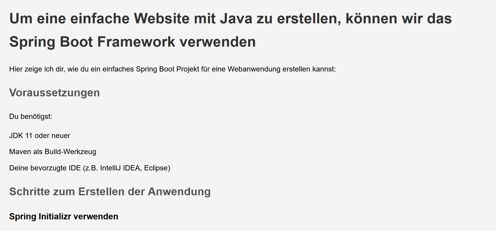

# Learning Website - Making Websites with Java

This repository contains a webpage where I’ve written the basics of web development with Java.

## Live Preview
You can view the webpage here: [Live Preview](https://rawcdn.githack.com/KLubina/learning-website-making-websites-with-java/9cd4c998e2bfdfeb480ad15e23ded47620edc257/index.html)

## Overview
The purpose of this project is to provide an introductory guide to web development using Java. It covers the fundamental concepts and best practices for building websites with Java-based technologies.

## Screenshot
